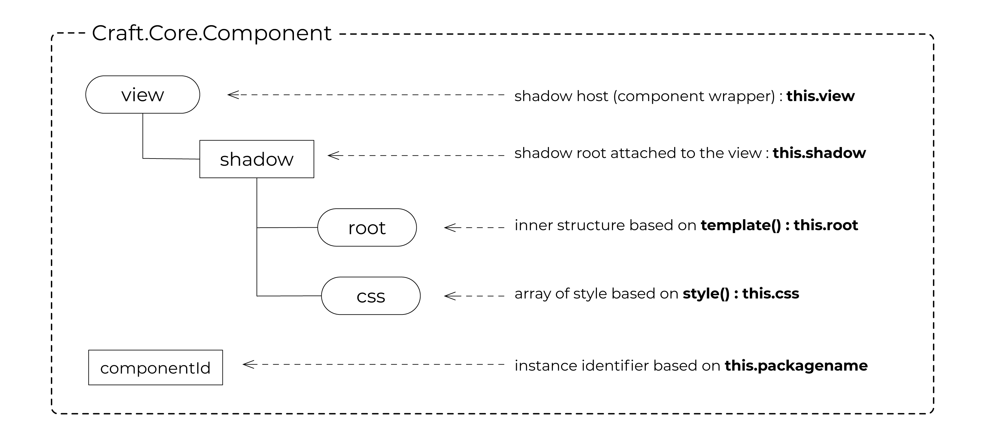
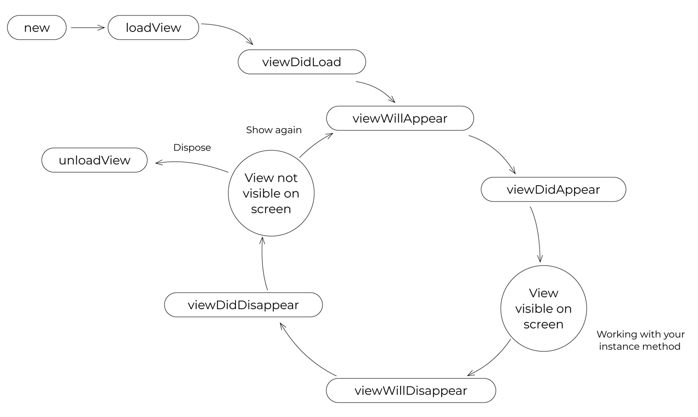

# Craft-UIKit

Craft-UIKit is a JavaScript UI library for **Inversion of Markup**. 

Web application based on Inversion of Markup inverts Markup and JavaScript.  
Markup should be fully encapsulated into the shadow element of the JavaScript object.

Markup principle something like this:

```javascript 
<Hello name="world"></Hello>
``` 

Inversion of Markup principle something like this:

```javascript 
viewController.append(new Hello({name:"world"}));
``` 

Mobile application devplopers are more familiar with this way.


## Component



The most core element of Craft-UIKit is representedy by the base class `Craft.Core.Component`.
This wraps shadow host, shadow root, tree under the shadow, styles for them and its actions.

Instance of Component is identified by `componentId`. 
This is automatically generated by its `packagename` defined as its class variable by default, with appending sequencial number to be identical in global. 
If it is not defined, just used its class name.

The component instance is a JavaScript object. 
So, you can access to the instance via its `componentId` from anywhere in you want.

### example

For example, your class has packagename `MyApp.Hello`.  
Your **componentId** will be something like `MyApp_Hello_0`.

``` 
console:

> var hello_world = new HelloWorld();
> hello_world.loadView();
> document.body.appendChild(hello_world.view);

> MyApp_HelloWorld_0
HelloWorld {packagename: "MyApp.HelloWorld", componentId: "MyApp_HelloWorld_0", view: div#MyApp_HelloWorld_0, css: Array(1), …}

> MyApp_HelloWorld_0.view
<div id="MyApp_HelloWorld_0">...</div>

> MyApp_HelloWorld_0.shadow
#shadow-root (open)

> MyApp_HelloWorld_0.root
<div class="root">...</div>

> MyApp_HelloWorld_0.css
[style#MyApp_HelloWorld_0_1]

> MyApp_HelloWorld_0.say()
(say() is invoked -> show "Hello World!" in the page)
``` 

※ Dot(`.`) is converted to underscore(`_`).  
※ componentId has auto generated suffix serial number.


## View and ViewController


The Component is concretized by `Craft.UI.View` and `Craft.UI.ViewController`. 
Both are sub-class of `Craft.Core.Component`.
View is an element in your application packing its template, style and action. 
ViewController is also a kind of View having some View elements in it, and manages them.

Your application may also have special ViewController called RootViewController. 
This is a root element of your application, 
and should be set by `Craft.Core.Context.setRootViewController` at the start of your application. 
In Craft-UIKit application, the RootViewController should also manage popstate event and history by implementing appropriate interface. 

Let's see a Hello World example:

```javascript 
class HelloWorld extends Craft.UI.DefaultViewController {
    constructor(){
        super();
        this.packagename = 'MyApp.HelloWorld';
    }
    viewDidLoad(callback){
        this.hello = new Hello();
        this.world = new World();
        if(callback){ callback(); }
    }
    say(){
        this.appendView(this.hello);
        this.appendView(this.world);
    }
    style(componentId){
        return `
            :host { width: 100%; }
            .root { display flex; flex-direction: row; }
        `;
    }
    template(componentId){
        return `
            <div class='root'></div>
        `;
    }
}

class Msg extends Craft.UI.View {
    style(componentId){
        return `
            .root { display: inline-block; margin: 10px; }
            .msg { color: blue; }
        `;
    }
    template(componentId){
        return `
            <div class='root'>
                <span class='msg'>${this.msg}<\span>
            </div>
        `;
    }
}

class Hello extends Msg {
    constructor(){
        super();
        this.packagename = 'MyApp.Hello';
        this.msg = 'Hello';
    }
}

class World extends Msg {
    constructor(){
        super();
        this.packagename = 'MyApp.World';
        this.msg = 'World!';
    }
    style(componentId){
        return super.style(componentId) + `
            .msg { color: red; }
        `;
    }
}
``` 

## Template and Style

Component has a DOM tree in `this.root` that is based on `template()`.

`template()` must return a HTML expression that starting with a single element. 
The returning HTML is evalutated as HTML template, 
and converted to a DOM fragment by Craft.Core.Component.renderView. 
Its first element is used for **this.root**. 

When you define `id` and `class` for the root element, you have to name it as 'root'. 
This is simplify cascading super class style sheet.

```javascript 
template(componentId){
    return `
        <div id='root' class='root'>
            ...
        </div>
    `;
}
``` 

```html
GOOD:
    <div>
        <span>Hello world!</span>
    </div>
    
BAD:
    <div>
        <span>Hello</span>
    </div>
    <div>
        <span>world!</span>
    </div>
    
Also BAD: 
    <!-- hello message: this is also a DOM -->
    <div>
        <span>Hello world!</span>
    </div>

```

Component also has shadowed style tags in **this.css**.
This is defined in `style()` method and it should return usual style sheet expression.
You can access host element **this.view** by `:host` pseudo class name. 

To cascade super class style, just append yours on it.

```javascript 
style(){
    return super.style() + `
        .msg { color: red; }
    `;
}
``` 

First argument for `template()` and `style()` is its componentId (same as this.componentId).
In `style` method, you may not use it, but sometimes it may be required to cascade styles of your super class. 
In `template` method, it is used for accessing its method.


## Component Method

Template, style and actions are encapsulated in the Component.

To call instance method from its template, all you have to do is just call it via `${componentId}`.

```javascript 
class Wow extends Craft.UI.View {
    say(msg){
        alert(`oh ${msg}`);
    }
    template(componentId){
        return `
            <div onclick='${componentId}.say("wow")'>Say wow</div>
        `;
    }
}
``` 

Traditional JavaScript programmer may like `self` instead of `componentId`.

```javascript 
class Wow extends Craft.UI.View {
    say(msg){
        alert(`oh ${msg}`);
    }
    template(self){
        return `
            <div onclick='${self}.say("wow")'>Say wow</div>
        `;
    }
}
``` 

Indeed, this is not default behaviour. 
As can be seen above, `window[componentId]` holds its instacne. 
This is enabled by setting `Craft.Core.Defaults.ALLOW_COMPONENT_SHORTCUT` to `true`. 
You may set this at the begenning of you app. 
You can select this behavior, but you may love to use this shortcut.

Without this shourcut, you can call instance method like following:

```javascript 
onclick="window.Craft.Core.ComopnentStack.get('${componentId}').say('wow')"
``` 

Additionaly, if you know comopnentId for another instance, you can call any method via it, like as global shared function.

Public library developer shoud write its template by verbose mode using fully quolifiied component access, to be able to run without shourcut. 


## Component Lifecycle

Component lifecycle is just a contract with you. 
If you write your own ViewController, you have to honor those definition to keep your life safe, 
like as Craft.Core.Component, Craft.UI.View and Craft.UI.DefaultViewController are doing so. 
In other words, while you extends those classes and keep this way, lifecycle is guaranteed.



| lifecycle method  | what is  |
|:------------------|:---------|
| loadView          | make this.view and this.css |
| viewDidLoad       | Called at the end of loadView |
| viewWillAppear    | Called just before appending this.view to the parent |
| viewDidAppear     | Called just after this.view appended to the parent |
| viewWillDisappear | Called just before removing this.view from its parent |
| viewDidDisappear  | Called just after this.view removed from its parent |
| unloadView        | remove view and css |

Related method:

| method      | what is    |
|:------------|:-----------|
| appendView  | append sub-component's view | 
| removeView  | remove sub-component's view | 
| append      | alias for appendView | 
| remove      | alias for removeView | 


## Routing and RootViewController


In Craft-UIKit application, RootViewController has responsibility for routing. 
At the time booting application via `Craft.Core.Bootstrap`, 
listener for `popstate` is registered against `RootViewController.didReceivePopstate`. 

`DefaultRootViewController.didReceivePopstate` extracts hash fragment from the window.location, 
and pass it to `resolveRoutingRequest`. 
You have to implement your routing logic in it. Or you have to override `DefaultRootViewController.didReceivePopstate` as you like.

```javascript 
class PageController extends Craft.UI.DefaultRootViewController {
    :
    resolveRoutingRequest(path,event){
        let match = path.match(/(\w*)/);
        let menu = match[1] || 'home';
        this.showMenu(menu,event);
    }
    :
}
``` 

## Booting application

Application entry point is `Craft.Core.Bootstrap.boot`. 
You must kick this function when `window.onload` occured. 

`boot` function requires an object containing a function named as `didBootApplication`. 
This is your application entry point. 

To start routing at booting, you have to call `didReceivePopstate` of your RootViewController. 
For convenience, this is implemented as `DefaultRootViewController.bringup`.

```javascript 
window.onload = function(){
    Craft.Core.Defaults.ALLOW_COMPONENT_SHORTCUT = true;
    Craft.Core.Bootstrap.boot({
        didBootApplication : function(){
            const rootViewController = new PageController();
            Craft.Core.Context.setRootViewController(rootViewController);
            rootViewController.bringup();
        }
    });
};
``` 

## License

MIT

